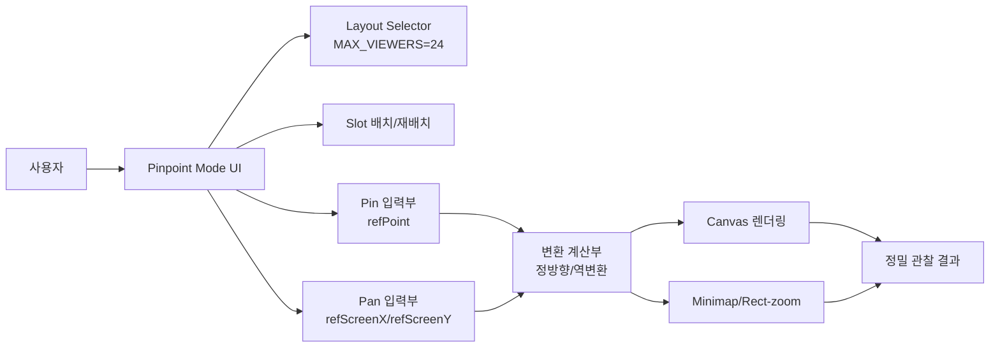
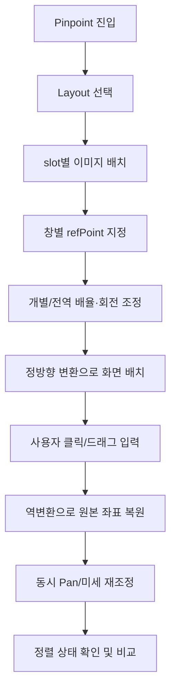
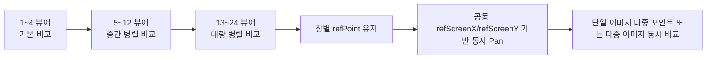

# compareX 직무발명서(초안)
## Pinpoint 참조점 고정 기반 회전/배율 정합 변환

> 본 문서는 내부 직무발명 검토용 초안입니다.  
> 출원서에 기재되는 최종 발명의 명칭/청구범위는 특허 명세서 작성 단계에서 별도로 확정합니다.  
> 작성 기준일: 2026-03-03

---

## 0. 문서 개요
이 문서는 compareX 프로젝트의 Pinpoint 기능을 기반으로 작성한 직무발명서 초안이다.  
핵심은 다음 한 문장으로 요약할 수 있다.

**“여러 이미지(또는 동일 이미지의 여러 구역)를 최대 24개 창으로 배치하고, 창별 기준점(refPoint)과 공통 화면 기준점(refScreenX/refScreenY)을 결합해 회전·배율 변화 중에도 정밀 비교를 유지하는 사용자 주도 정합 기술.”**

읽는 대상은 특허 담당자, 선행기술 조사 업체, 개발팀, 그리고 비전문 검토자까지 포함한다.  
그래서 설명은 `쉬운 설명`과 `기술 설명`을 함께 제공한다.

## 0-1. 대표 발명 2건 (2축 분리형)
변환 수식 단독 보호보다, 아래 2축을 분리 출원하고 상호 종속항으로 연결하는 전략이 권리 강도에 유리하다.

| 구분 | 발명 축 | 핵심 구성 | 권리화 목적 |
| --- | --- | --- | --- |
| A | 좌표 정합 엔진 | `refPoint`/`refScreenX-refScreenY` 분리, 정방향/역변환 폐루프, 개별/전역 배율·회전 결합 | 엔진 모방 방지 |
| B | Pinpoint 운영 시스템 | 최대 24 레이아웃, slot 배치/재배치, 창별 핀, 동시 Pan, 단일/다중 관찰 워크플로 | UI/운용 모방 방지 |

정리하면 A는 "좌표 계산 코어", B는 "현장 운용 파이프라인"이며, B 종속항에서 A를 참조하도록 설계한다.

---

## 1) 발명의 명칭 (내부 검토용)
출원서 최종 명칭은 별도 확정하되, 현재 발명을 직관적으로 이해할 수 있는 내부 명칭 후보는 아래와 같다.

### 1-1. 내부 명칭 후보
1. **다중 뷰어 참조점 고정 정밀 정합 및 동기 탐색 시스템**
2. **창별 기준점-공통 화면 기준점 결합형 이미지 정렬 인터페이스**
3. **Pinpoint 기반 다중 포인트 병렬 관찰 정합 방법 및 장치**

### 1-2. 본 문서 대표 명칭(임시)
본 문서에서는 다음을 대표 명칭으로 사용한다.

**“참조점 고정 기반 다중 뷰어 회전·배율 정합 및 동기 Pan 탐색 기술”**

---

## 2) 발명 키워드 (선행기술 조사용)
아래 키워드는 선행기술 조사 업체가 검색에 바로 사용할 수 있도록 일반 기술용어 중심으로 작성했다.  
약어는 Full Name을 함께 표기했다.

| 번호 | 키워드 | 검색 의도 |
| --- | --- | --- |
| 1 | Reference Point Anchored Image Alignment | 이미지 내 기준점 고정 정렬 |
| 2 | Shared Screen Anchor Coordinate | 공통 화면 기준점 동기화 |
| 3 | Forward and Inverse Coordinate Transform Loop | 정방향/역변환 폐루프 |
| 4 | Multi-Viewer Synchronized Pan and Zoom | 다중 창 동시 Pan/Zoom |
| 5 | Global-Local Hybrid Scale and Rotation Control | 전역+개별 혼합 제어 |
| 6 | Interactive Image Registration User Interface | 사용자 상호작용 정합 UI |
| 7 | WSI (Whole Slide Image) Comparative Navigation | 병리/현미경 슬라이드 비교 탐색 |
| 8 | GUI (Graphical User Interface) Multi-Window Alignment | 다중 창 정렬 GUI |
| 9 | ROI (Region of Interest) Persistent Tracking | 관심영역 지속 추적 |
| 10 | KNN (K-Nearest Neighbors) Feature Matching Alignment | 특징점 매칭 기반 자동 정합 비교군 |
| 11 | NCC (Normalized Cross-Correlation) Image Registration | 상관기반 정합 비교군 |
| 12 | Affine Transformation Guided Visual Comparison | 아핀 변환 기반 비교 |
| 13 | Human-in-the-loop Precision Alignment | 사용자 개입형 정밀 정합 |
| 14 | 24-Viewer Layout Parallel Observation | 24창 병렬 관찰 |
| 15 | Single Image Multi-Point Parallel Inspection | 단일 이미지 다중 포인트 병렬 검사 |

---

## 3) 대표 선행기술과 본 발명 차이점
### 3-1. 한 줄 요약
선행기술 다수는 자동 정합(특징점/서브필드/전역변환) 또는 일반 동기 브라우징 중심이고, 본 발명은 **사용자 주도 정밀 정합 워크플로**를 중심으로 한다.

### 3-2. 외부 웹 조사 기준
- 검색일: **2026-03-03**
- 조사 출처: Google Patents, Justia Patents
- 선정 원칙: Pinpoint와 직접 비교 가능한 “동기 탐색”, “특징점 정합”, “슬라이드 참조 정합”, “서브필드 정합” 계열

### 3-3. 대표 선행기술 5건 비교표
| 문헌 | 목적 | 핵심 구성 | 효과 | 본 발명과 차이 |
| --- | --- | --- | --- | --- |
| US8890887B2 (Synchronized image browsing) | 관련 이미지 동시 브라우징 | Sync on/off, pan/zoom/rotate 동시 반영, 윈도우 간 차이값 유지 | 다중 이미지 동시 탐색 편의 향상 | 본 발명은 단순 동기 이동이 아니라 `창별 refPoint 고정 + 공통 refScreenX/refScreenY + 정/역변환 폐루프`를 결합해 정밀 정합을 유지 |
| US20090040186A1 (Displaying Multiple Synchronized Images) | 멀티터치 기반 다중 이미지 동기 표시 | primary/secondary 뷰, baseline 길이/방향으로 secondary 관점 제어 | 지도/지리영상 탐색성 향상 | 본 발명은 터치 baseline 기반 뷰 제어가 아니라 이미지 정합 좌표계(참조점 고정)를 중심으로 다중 샘플 비교에 특화 |
| US12266143B2 / US20220327796A1 (Salient feature point alignment) | 반도체 검사 영상 자동 정렬 | 3개 이상 salient feature points 탐지/매칭, 전역 오프셋/회전 보정 | 자동 정렬 정확도 향상 | 본 발명은 자동 특징점 정렬이 핵심이 아니며, 사용자가 지정한 관심점을 화면에 유지하면서 비교하는 인터랙티브 정합 워크플로가 중심 |
| US10088658B2 (Referencing in multi-acquisition slide imaging) | 재획득 슬라이드 간 참조 정합 | subset 정렬로 rotation/scale/translation 추정 후 전체 적용 | 스테이지 재배치 오차 보정 | 본 발명은 백엔드 일괄 정합이 아니라 실시간 UI 조작(핀 지정, 개별/전역 제어, 동시 Pan)으로 관찰 과정 자체를 정합 |
| US11189023 (Anchor-point-enabled multi-scale subfield alignment) | 다중 스케일 서브필드 자동 정렬 | alignability map, threshold 기반 anchor point 선택, subfield 정렬 | 난이도 높은 영상에서 자동 정렬 안정성 개선 | 본 발명은 자동 anchor 탐색이 아닌 사용자 지정 기준점을 중심으로 최대 24뷰어 병렬 관찰과 단일 이미지 다중 포인트 비교까지 제공 |

### 3-4. 차이점 요약(목적/구성/효과)
1. **목적 차이**
- 선행기술: 정렬 자체를 자동화/정확화
- 본 발명: 사람이 비교·판독하는 과정에서 기준점을 잃지 않게 하여 정밀 관찰 효율을 높임

2. **구성 차이**
- 선행기술: 특징점 검출, 전역/로컬 변환 추정, 서브필드 보정
- 본 발명: 창별 기준점(`refPoint`), 공통 화면 기준점(`refScreenX/refScreenY`), 개별+전역 회전/배율, 동시 Pan, 24뷰어 레이아웃

3. **효과 차이**
- 선행기술: 자동 정렬 오차 감소
- 본 발명: 사용자 조작에서 재팬/재정렬 반복 감소, 다중 창 비교 집중도 향상, 단일 이미지 다중 관심점 병렬 검토 가능

### 3-5. 선행기술 조사 로그(요약)
| 쿼리 | 채택 문헌 | 제외/비고 |
| --- | --- | --- |
| synchronized image browsing patent pan zoom rotate | US8890887B2 | 유사한 동기 탐색 축으로 채택 |
| displaying multiple synchronized images baseline touch | US20090040186A1 | 지도 UI 중심이나 다중 동기 표시 축으로 채택 |
| salient feature point based image alignment patent | US12266143B2 | 자동 특징점 정렬 대표 문헌으로 채택 |
| multi-acquisition slide imaging referencing rotation scale translation | US10088658B2 | 슬라이드 재획득 정합 대표 문헌으로 채택 |
| anchor-point-enabled multi-scale subfield alignment | US11189023 | 자동 anchor/subfield 정렬 대표 문헌으로 채택 |
| semiconductor reference test image coarse fine alignment | US20190139208A1 | 내용 중복성이 높아 비교표 본문에서는 제외, 보조 참고문헌으로 유지 |

### 3-6. 선행기술 대비 A/B 축 매핑 요약
| 선행기술군 | 축 A(좌표 정합 엔진) 대비 | 축 B(Pinpoint 운영 시스템) 대비 |
| --- | --- | --- |
| 동기 브라우징 계열 (US8890887B2, US20090040186A1) | 단순 동기 이동은 있으나 `refPoint` 고정 + 정/역변환 폐루프 결합이 약함 | 24 레이아웃, slot 재배치, 창별 핀/동시 Pan 통합 워크플로까지는 직접 제시되지 않음 |
| 자동 특징점/서브필드 정렬 계열 (US12266143B2, US11189023) | 자동 정합 정확도 중심이며 사용자 지정 기준점 기반 상호작용 폐루프가 다름 | 자동 백엔드 정렬 중심으로, 사용자 주도 단계형 관찰 파이프라인과 목적이 다름 |
| 슬라이드 참조 정합 계열 (US10088658B2) | 라운드 간 변환 추정은 유사축이 있으나 화면 기준점 공유형 탐색 모델이 다름 | 실시간 다중창 운용(레이아웃/재배치/동시 Pan)보다 백엔드 정합 자동화 중심 |

---

## 4) 발명의 적용 계획 (compareX 프로젝트 적용)
### 4-1. 현재 적용 상태
본 발명은 compareX의 Pinpoint 모드에 **이미 적용 중**이다.

핵심 반영 포인트:
1. 레이아웃 선택: `LayoutGridSelector`에서 최대 24 뷰어 제한
2. 창별 기준점 저장: `PinpointMode.handleSetRefPoint`
3. 공통 화면 기준점 이동: `ImageCanvas` Pan 시 `setViewport({refScreenX, refScreenY})`
4. 정방향/역변환 수식 적용: `ImageCanvas`, `viewTransforms`
5. 슬롯 재배치: Shift/Swap 기반 viewer arrangement

### 4-2. 적용 목적
1. 다중 샘플의 동일 지점을 반복적으로 맞추는 시간을 줄인다.
2. 분석자가 관찰 중 기준점을 잃지 않게 한다.
3. 단일 이미지에서도 여러 관심점을 동시에 비교해 판독 반복을 줄인다.

### 4-3. 확대 적용 계획
1. Pinpoint 튜토리얼에 “단일 이미지 다중 포인트 병렬 관찰” 시나리오 추가
2. 정량 검증 기능(재팬 횟수/재도달 시간 측정 로그) 추가
3. 팀 단위 리뷰(의료/반도체/검사)용 표준 워크플로 템플릿 제공

---

## 5) 발명의 배경
### 5-1. 발명 계기
현장 비교 작업에서는 확대·회전을 조금만 반복해도 관심 지점이 화면에서 쉽게 벗어나고, 여러 창을 오가며 다시 맞추는 시간이 많이 든다.  
특히 이미지 수가 늘어날수록 “같은 위치를 보고 있는지” 자체를 확인하는 데 큰 비용이 든다.

### 5-2. 해결하고자 한 문제
1. 중심 고정 방식의 한계: 관심 지점이 아닌 화면 중심 기준으로 움직여 재팬이 반복됨
2. 다중 창 비교의 한계: 창마다 비교 기준이 달라져 판단 일관성이 흔들림
3. 단일 이미지 심층 분석의 한계: 포인트를 바꿀 때마다 이전 위치 문맥이 끊김

### 5-3. 핵심 해결 전략
1. 이미지 기준점(`refPoint`)과 화면 기준점(`refScreenX/refScreenY`) 분리
2. 정방향 렌더링과 역변환 입력 해석을 동일 파라미터로 연결
3. 개별/전역 배율·회전 혼합 제어
4. 최대 24 뷰어에서 동시 Pan과 병렬 관찰 지원

---

## 6) 발명의 필수 구성요소
### 6-1. 필수 구성요소 목록
1. **레이아웃 제어부**: rows x cols 선택, 최대 24 뷰어 한도 적용
2. **슬롯 배치부**: 이미지를 slot 단위로 배치하고 재배치(Shift/Swap)
3. **기준점 입력부**: 창별 `refPoint` 지정
4. **공통 화면 기준점 관리부**: `refScreenX/refScreenY` 유지 및 동시 Pan
5. **변환 계산부**: 정방향(drawX/drawY)과 역변환(screen->image) 계산
6. **혼합 제어부**: 개별/전역 배율 및 회전 결합
7. **보조 관찰부**: minimap/rect-zoom에서 동일 좌표체계 재사용
8. **검증/확장부**: 반복성 측정, 그룹 동기화·AI 보조 연계 가능 인터페이스

### 6-2. 도면 1: 시스템 구조도 (구조 관점)

**도면 1 설명(쉬운 버전):**  
사용자가 핀을 찍고 화면을 움직이면, 계산기가 “이미지를 어디에 그릴지”를 다시 계산해 항상 같은 기준점 비교를 돕는다.

**도면 1 설명(기술 버전):**  
`refPoint`와 `refScreenX/refScreenY`를 입력으로 하는 변환 계산부가 렌더링/입력 해석을 통합 제어하며, 동일 좌표체계를 보조 뷰까지 전파한다.

### 6-3. 도면 2: 동작 순서도 (동작 관점)

### 6-4. 도면 3: 24-뷰어 관찰 운영 개념도

### 6-5. Best 실시예
#### 실시예 A: 다중 이미지 비교형
1. 12개 샘플 이미지를 3x4 레이아웃에 배치
2. 각 창에서 동일 결함 후보 지점에 `refPoint` 설정
3. 전역 회전으로 큰 방향 오차를 먼저 정리
4. 창별 회전/배율 미세 조정
5. 동시 Pan으로 결함 주변 구역 스캔
6. 결과: 재팬 횟수 감소, 창 간 비교 전환 속도 향상

#### 실시예 B: 단일 이미지 다중 포인트형
1. 동일 이미지를 6개 slot에 배치
2. slot마다 서로 다른 관심점(균열/경계/마커/텍스처)을 `refPoint`로 설정
3. 동시 Pan으로 공통 방향 탐색을 수행하며 포인트별 변화를 병렬 관찰
4. 결과: 단일 이미지 내부 다중 포인트 검토를 한 화면에서 유지

### 6-6. 발명 효과
1. 정렬 일관성: 기준점 드리프트 감소
2. 조작 효율: 목표 포인트 재도달 시간 단축
3. 비교 신뢰도: 같은 위치를 보고 있다는 확신 증가
4. 확장성: 24 뷰어 내 병렬 관찰 운영 가능

### 6-7. 데이터/Simulation/그래프 템플릿
아래 템플릿은 실제 측정값 입력용이며, 현재는 형식만 제공한다.

#### (a) 실험 표 템플릿
| 조건 | 뷰어 수 | 과업 | 평균 재팬 횟수 | 평균 재도달 시간(sec) | 비교 전환 시간(sec) |
| --- | ---: | --- | ---: | ---: | ---: |
| Baseline(중심고정) | 4 | 동일 지점 재확인 |  |  |  |
| Pinpoint | 4 | 동일 지점 재확인 |  |  |  |
| Baseline(중심고정) | 12 | 다중 창 비교 |  |  |  |
| Pinpoint | 12 | 다중 창 비교 |  |  |  |
| Baseline(중심고정) | 24 | 대량 병렬 비교 |  |  |  |
| Pinpoint | 24 | 대량 병렬 비교 |  |  |  |

#### (b) 그래프 작성 가이드
1. X축: 뷰어 수(1, 4, 12, 24)
2. Y축1: 재팬 횟수
3. Y축2: 재도달 시간
4. 비교군: Baseline vs Pinpoint

---

## 7) 발명 설명 1~6 관점 정리
아래는 직무발명서 작성 시 “큰 틀(관점)”로 분리한 설명이다.

### 7-1. 발명 설명 1: 구조 관점
**쉬운 설명:**  
이 기술은 “창마다 기준점 하나”와 “모든 창이 같이 따르는 화면 기준점 하나”를 같이 관리하는 구조다.

**기술 설명:**  
`refPoint`는 viewer별 독립 상태, `refScreenX/refScreenY`는 shared viewport 상태로 관리된다.  
이 분리 구조가 정합 안정성과 동시 Pan 일관성을 동시에 만든다.

**핵심 도면:** 도면 1

### 7-2. 발명 설명 2: 동작 관점
**쉬운 설명:**  
순서는 간단하다. 창 배치 -> 핀 찍기 -> 확대/회전 -> 같이 이동 -> 확인.

**기술 설명:**  
Layout/slot 배치 후, Pin 입력에서 refPoint를 업데이트하고, Pan 입력에서 shared viewport를 갱신한다.  
정방향 변환으로 그린 결과와 역변환으로 해석한 좌표가 같은 파라미터 집합을 공유한다.

**핵심 도면:** 도면 2

### 7-3. 발명 설명 3: 좌표·수식 관점
**쉬운 설명:**  
“내가 찍은 점을 화면의 원하는 자리에서 안 놓치게” 계산하는 수학이다.

**기술 설명:**  
총 배율 `totalScale = individualScale * globalScale`, 총 회전 `theta`를 이용해 `drawX/drawY`를 계산한다.  
사용자 입력은 screen->image 역변환으로 환산되어 클릭·핀·탐색의 좌표 일관성을 보장한다.

### 7-4. 발명 설명 4: 발명 시스템 관점(확장 범주)
**쉬운 설명:**  
이미지가 많아져도(최대 24창) 같은 방식으로 비교할 수 있다.

**기술 설명:**  
레이아웃 확장 시에도 동일 좌표모델을 유지하며, slot 재배치(Shift/Swap) 후에도 정렬 문맥을 보존한다.  
단일 이미지 다중 포인트 관찰과 다중 이미지 동시 비교를 하나의 파이프라인으로 처리한다.

**핵심 도면:** 도면 3

### 7-5. 발명 설명 5: 운용·검증 관점
**쉬운 설명:**  
좋은 기술인지 확인하려면 “얼마나 덜 헤매는지”를 숫자로 보면 된다.

**기술 설명:**  
핵심 지표는 재팬 횟수, 포인트 재도달 시간, 창 간 전환 시간, 드리프트(px)다.  
뷰어 수 증가(1/4/12/24)에 따른 성능 유지성을 함께 측정해야 한다.

### 7-6. 발명 설명 6: 미래 기술 결합 관점
**쉬운 설명:**  
나중에 AI가 “여기를 핀으로 잡으세요”를 추천해도, 지금 구조를 그대로 활용할 수 있다.

**기술 설명:**  
현재 구조는 사용자 주도 정합이지만, 기준점 후보 추천(vision model), 그룹 동기화, 자동 프리셋 보정과 결합 가능한 인터페이스 경계를 갖는다.  
단, 본 발명의 현재 보호 포인트는 자동 추천이 아니라 **참조점 고정 좌표모델 + 인터랙션 파이프라인**이다.

---

## 8) 발명의 활용
### 8-1. 경쟁사 적용시 확인 가능 여부
**확인 가능성이 높다.**  
이 발명은 사용자 조작과 UI 결과가 외부에서 관찰 가능한 유형이므로, 데모/영상/제품 사용으로도 핵심 동작을 일정 수준 확인할 수 있다.

### 8-2. 확인을 위한 분석 방법
1. 제품 데모에서 다중 창 동시 Pan 동작 확인
2. 창별 기준점(핀) 독립 저장 여부 확인
3. 회전/배율 조정 후 기준점 화면 고정 유지 여부 확인
4. 단일 이미지를 여러 창에 배치해 다중 포인트 병렬 관찰이 가능한지 확인
5. 레이아웃 확장 시(대량 창) 정렬 문맥 유지 여부 확인

### 8-3. 매칭 포인트(어떤 부분을 보면 알 수 있는지)
1. `Pin/Pan` 모드 분리 UI
2. 창별 핀 표시 및 편집 UX
3. 전역+개별 배율/회전 동시 제공 여부
4. 동시 Pan 시 전 창 동일 방향/동일량 이동 여부
5. 레이아웃 확장(대량 창) 운영 시 성능/일관성 유지 여부

### 8-4. 다른 회사 방법 대비 본 발명의 우수점
1. 자동 정합 전용 제품 대비: 사람이 실제 비교하는 과정(탐색/판독)의 효율을 직접 개선
2. 일반 동기 브라우징 대비: 기준점 고정 정합으로 “같은 지점 비교”의 신뢰도를 높임
3. 단일 이미지 분석 툴 대비: 다중 포인트 병렬 관찰로 문맥 전환 비용 감소
4. 소수 뷰 중심 툴 대비: 24뷰어 범위 운영으로 대량 비교 시나리오 확장성 확보

### 8-5. 경쟁사 도입 가능성
도입 가능성은 높다. 이유는 다음과 같다.
1. 사용자 체감 효익이 명확(재팬 감소, 재도달 시간 감소)
2. 의료/반도체/검사 등 다분야에 공통 적용 가능
3. 구현 난이도는 중간 수준이지만 UI-좌표모델 통합 설계가 필요해 단순 모방이 어렵다

---

## 9) 리스크 및 권리화 유의사항
1. UI 버튼 구성만 넓게 청구하면 자명성 리스크가 크다.
2. 변환 수식 단독 청구도 선행기술과 충돌 가능성이 높다.
3. 따라서 권리화는 **2축 분리형**으로 설계한다.
- 축 A: 좌표모델(`refPoint`/`refScreen`), 정/역변환 폐루프, 개별/전역 배율·회전 결합
- 축 B: 24뷰어 운영, slot 재배치, Pin/Pan 단계 분리, shared viewport 동시 Pan
4. B 축 종속항에서 A 축 요소를 참조하도록 설계해 회피설계를 어렵게 만든다.
5. “완전 자동 정합”으로 과장하면 구현 사실과 불일치하므로 금지한다.

---

## 10) compareX 구현 근거 (코드 연결)
1. 레이아웃 24 상한: `src/components/LayoutGridSelector.tsx` (`MAX_VIEWERS = 24`)
2. Pinpoint 모드 제어: `src/App.tsx` (Mode, Layout, Pin/Pan, 글로벌 제어)
3. 기준점 입력/화면 기준점 갱신: `src/modes/PinpointMode.tsx` (`handleSetRefPoint`)
4. slot 배치 및 동일 파일 다중 뷰어 추적: `src/modes/PinpointMode.tsx` (`loadFileToViewer`, `getFileViewerKeys`)
5. Pin 클릭 역변환/동시 Pan: `src/components/ImageCanvas.tsx`
6. 정방향/역변환 계산: `src/utils/viewTransforms.ts`
7. minimap 동일 좌표계: `src/components/Minimap.tsx`

---

## 11) 외부 선행기술 링크
1. US8890887B2 (Synchronized image browsing): https://patents.google.com/patent/US8890887B2/en
2. US20090040186A1 (Displaying Multiple Synchronized Images): https://patents.google.com/patent/US20090040186A1/en
3. US12266143B2 (Salient feature point based image alignment): https://patents.google.com/patent/US12266143B2/en
4. US20220327796A1 (Salient feature point based image alignment publication): https://patents.google.com/patent/US20220327796A1/en
5. US10088658B2 (Referencing in multi-acquisition slide imaging): https://patents.google.com/patent/US10088658B2/en
6. US11189023 (Anchor-point-enabled multi-scale subfield alignment): https://patents.justia.com/patent/11189023
7. US20190139208A1 (Semiconductor reference/test alignment, 보조 참고): https://patents.justia.com/patent/20190139208

---

## 12) 결론
본 발명의 실질적 가치는 “자동 정합 알고리즘 자체”가 아니라,  
**사용자가 실제로 비교하는 순간에 기준점을 놓치지 않게 만드는 정합 인터페이스 기술**에 있다.

직무발명 관점에서 권리화 단위는 다음 2건으로 분리하는 것이 합리적이다.
1. 발명 A(좌표 정합 엔진): 창별 기준점 고정 + 공통 화면 기준점 + 정/역변환 폐루프
2. 발명 B(Pinpoint 운영 시스템): 최대 24 뷰어 레이아웃, slot 배치/재배치, 창별 핀, 동시 Pan, 단일/다중 병렬 관찰

A/B를 종속항으로 연결하면 엔진 모방과 운영 모방을 동시에 방어할 수 있고, compareX의 제품 차별성과 직접 연결되는 출원 전략을 구성할 수 있다.
